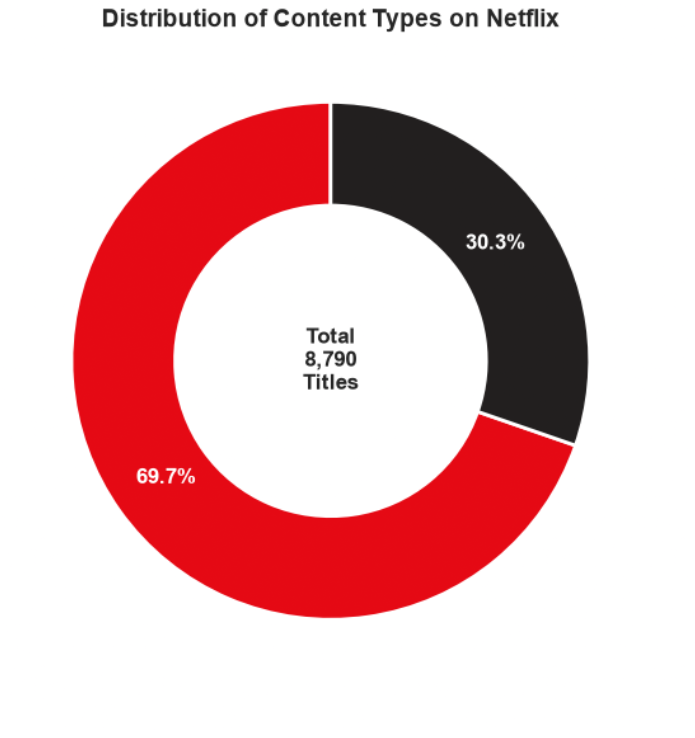
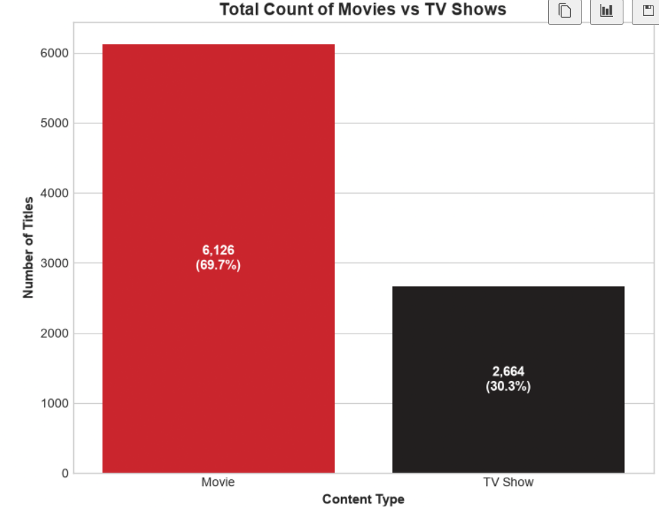

# Netflix-Data-Analysis
Analyzing and visualizing the Netflix library using Python through six tasks presented by Auspify Technologies

Tasks Progress
- [x] Task 1 : Content Type Analysis
- [ ] Task 2 : Netflix Data Cleaning & Preparation
- [ ] Task 3 : Country-Wise Content Analysis
- [ ] Task 4 : Content Rating & Genre Analysis
- [ ] Task 5 : Trend Analysis by Release Year
- [ ] Task 6 : Netflix Business Insights Report

## Task 1
Analyzing the baseline distribution and proportions of Movies and TV Shows available on Netflix

### Key points :
Total Titles Analyzed : 8790
Movies Count : 6126 (69.7%)
TV Shows Count : 2664 (30.3%)

### Visualization

### Business Insights And Recommendations
1 **Most Preferred Content :** Movies make up approximately **70%** of the total library driven by rapid production and release cycles
2 **Engagement vs. Volume :** While movies account for the majority of the content TV series are the primary driver of long term user retention and subscription growth
3 **Strategic Move :** Netflix should balance its content portfolio by increasing investment in TV series to reduce churn rates
